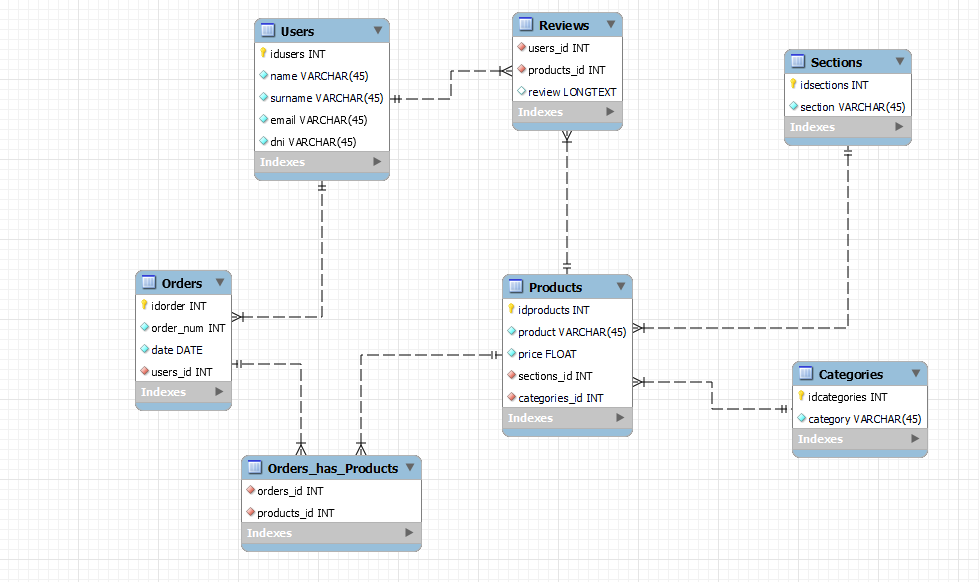
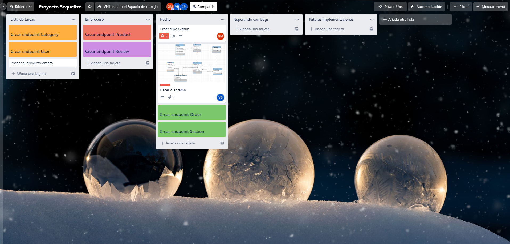
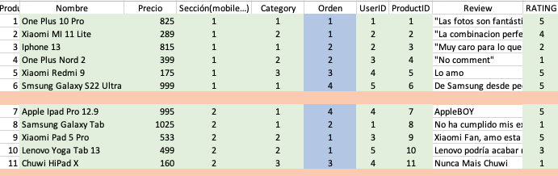
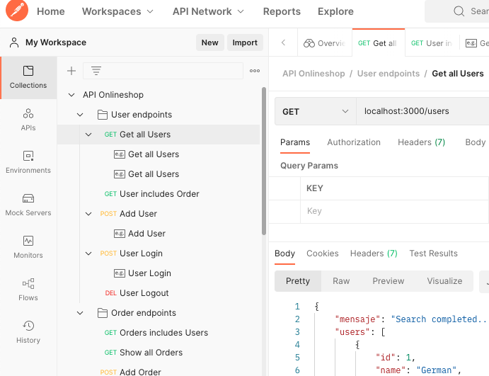

# About The Project -

## Online Shop

The backend project will combine the knowledge acquired in the following technologies [node + express] technologies, as well as mysql/sequelize.

The project will consist of an online shop (e-commerce) for devices (phones, tablets, computers and wearables).

## Built with...

_This Project was developed with the following technologies_

- JavaScript
- Dependencies: mySql2, Express, Sequelize, Nodemon, Nodemailer, Multer, Jsonwebtoken, Bcryptjs
- Postman
- Trello

## Action Route

1. Modelling the Online Shop Diagram (fig1).

- Table Users.
- Table Orders.
- Table Reviews.
- Table Products.
- Section Table



2. Defining tasks in Trello.



3. Building relations with Sequelize, it's important to review the [Sequelize Documentation](https://sequelize.org/docs/v6/getting-started/).

4. Working On Endpoints.

5. Adding field validations.

6. Building seeds (Users, Products, Orders & Reviews). Improving the organisation with an Excel File.



7. Implementing user registration with confirmation via email. We need to use [Multer Documentation](https://www.npmjs.com/package/multer).

8. Show Endpoints in Postman[API OnlineSHop](https://documenter.getpostman.com/view/21174543/Uz5ArJnd)

### Getting Started - Installation

To deploy this project you must clone the repository through the following link:

1. Clone the folder

```
https://github.com/Molerog/BackendOnlineShop
```

2.  Install dependecies

```
npm i
```

3. If you don't have Sequelize installed in your System, you have to write this line.

```
npm install sequelize-cli -g
```

4. Migrate db

```
npm sequelize db:migrate
```

5. Install Seeds

```
npx sequelize db:seed:all
```

#### Preview



## Author

👤 **Germán Molero**
👤 **Vince BC**

- GitHub: [@Molerog](https://github.com/Molerog)
- Github: [@Vincecoorp21](https://github.com/Vincecoorp21)

This project was developed By [Germán Molero](https://github.com/Molerog) & [Vicente Barberá - Vince BC -](https://github.com/Vincecoorp21)
